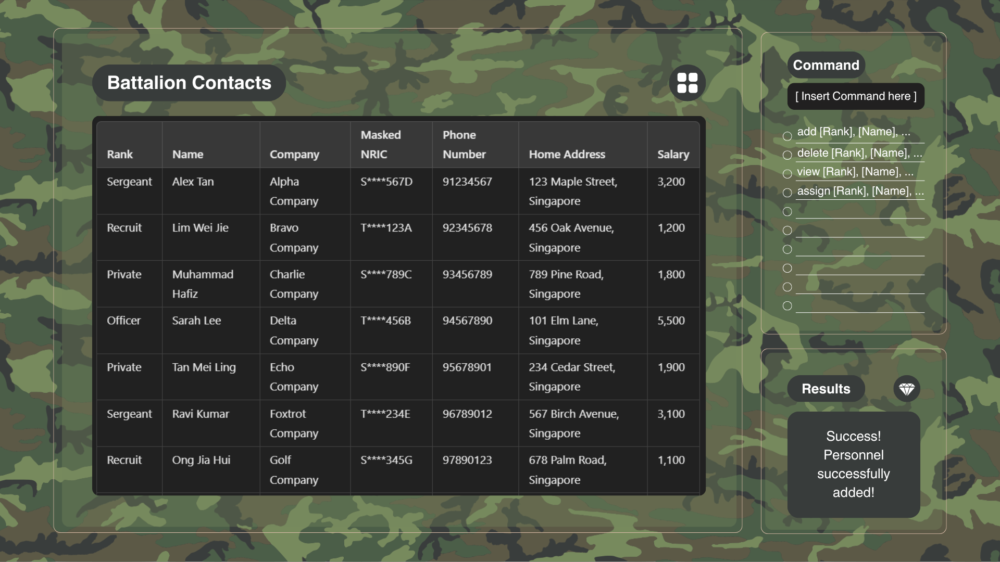

* HRQuickAccess is an application for the S1 Branch staff (i.e. Human resource) for an Army Battalion, responsible for managing and organizing extensive troop information across various roles, ranks, and duties. 
  Features:
  * Add entry - Takes in: Name, Phone number, Home Address, Department, Position, Salary
  * Add duty - Takes in: PersonnelID, duty dates
  * Delete entry - Takes in: PersonnelID
  * View entry - Takes in: PersonnelID
* The project is used for quick, efficient access to troop details for streamlined communication and duty scheduling.
  * It is **written in OOP fashion**.
  * It contains **user and developer documentation**.
* It is named `HRQuickAccess` (`HRQA` for short).
* This project is based on the AddressBook-Level3 project created by the [SE-EDU initiative](https://se-education.org).
