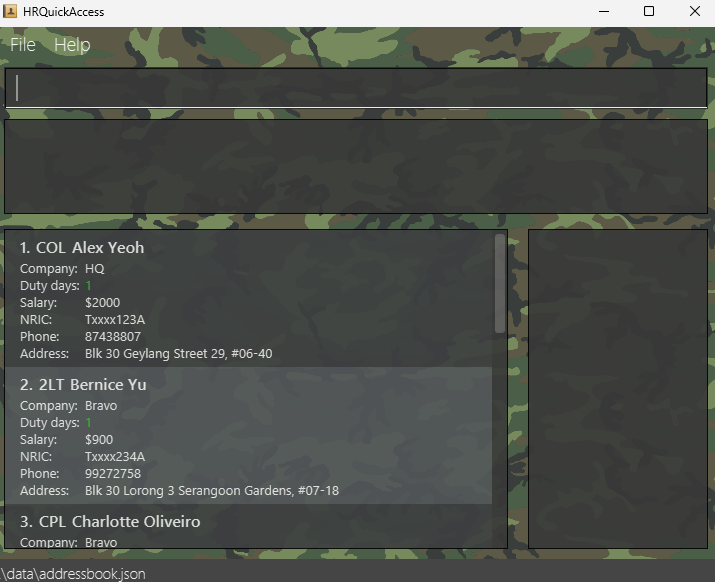

* HRQuickAccess is an application for the S1 Branch staff (i.e. Human resource) for an Army Battalion, responsible for managing and organizing extensive troop information across various roles, ranks, and duties. 
  Features:
  * Add entry: Used to input personnel’s mandatory information into the application and create a single entry for the personnel.
  * Delete entry: Used to delete a personnel's entry from the application contact list.
  * Edit entry: Used to edit a personnel’s entry from the application contact list.
  * Find entry: Used to find a personnel from the application contact list based on their name.
  * View entry: Used to view a personnel’s duty entries.
  * Assign Duty: Used to assign a personnel’s duty in the application contact list
  * Unassign duty: Used to unassign a personnel’s duty in the application contact list

* The project is used for quick, efficient access to troop details for streamlined communication and duty scheduling.
  * It is **written in OOP fashion**.
  * It contains **user and developer documentation**.
* It is named `HRQuickAccess` (`HRQA` for short).
* This project is based on the AddressBook-Level3 project created by the [SE-EDU initiative](https://se-education.org).
