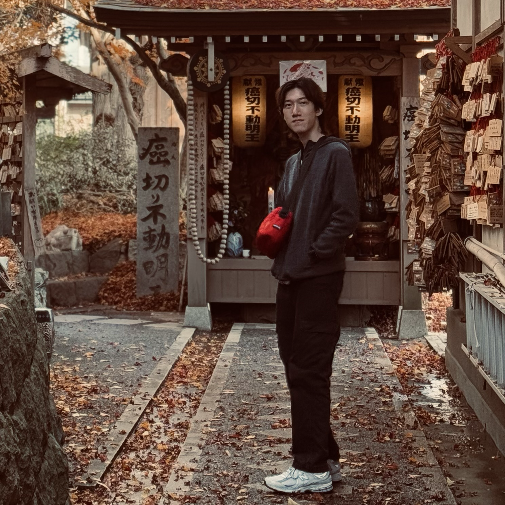

# About Us

We are a team based in the [School of Computing, National University of Singapore](http://www.comp.nus.edu.sg).

You can reach us at the email `seer[at]comp.nus.edu.sg`

## Project team

### Lee Chen Xuan

[[github](https://github.com/CXl0l0)]
[[email](mailto:leechenxuan234@gmail.com)]

- Role: Developer
- Responsibilities: Proof-reading

### Kong Zi Hung

 

Hi! I’m a Year 2 Computer Science student at the National University of Singapore (NUS), interest in  database and network system.

[📄 Linkedin](https://www.linkedin.com/in/kong-zi-hung-a32ab8288/)   
[💻 GitHub](https://github.com/zihung20)   
[✉️ Email](mailto:zihung20@gmail.com)   
[🧾 Zi Hung's Project Portfolio Page](./team/zihung20.md)
- **Role**: Student Developer
- **Responsibilities**: Technical support, feature integration, and documentation

### Jun Heng

[[github](http://github.com/junixm)]
[[portfolio](https://sites.google.com/view/leejunheng)]

* Role: Developer
* Responsibilities: Deliverables and deadlines.
  Ensure project deliverables are done on time and in the right format.

### Corey Siah

[[github](http://github.com/coreysiah)]
[[email](mailto:e1427143@u.nus.edu)]

* Role: Developer
* Responsibilities: User story and feature list
