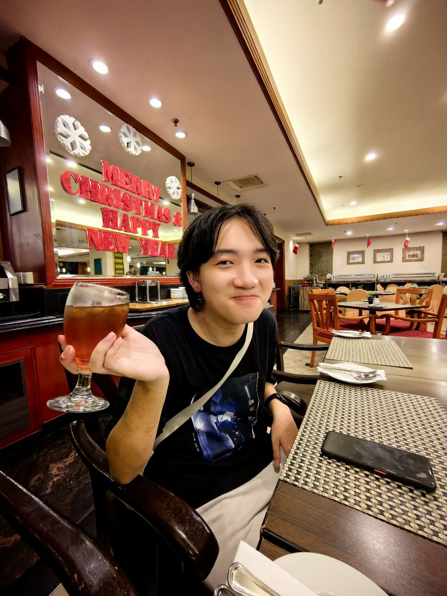
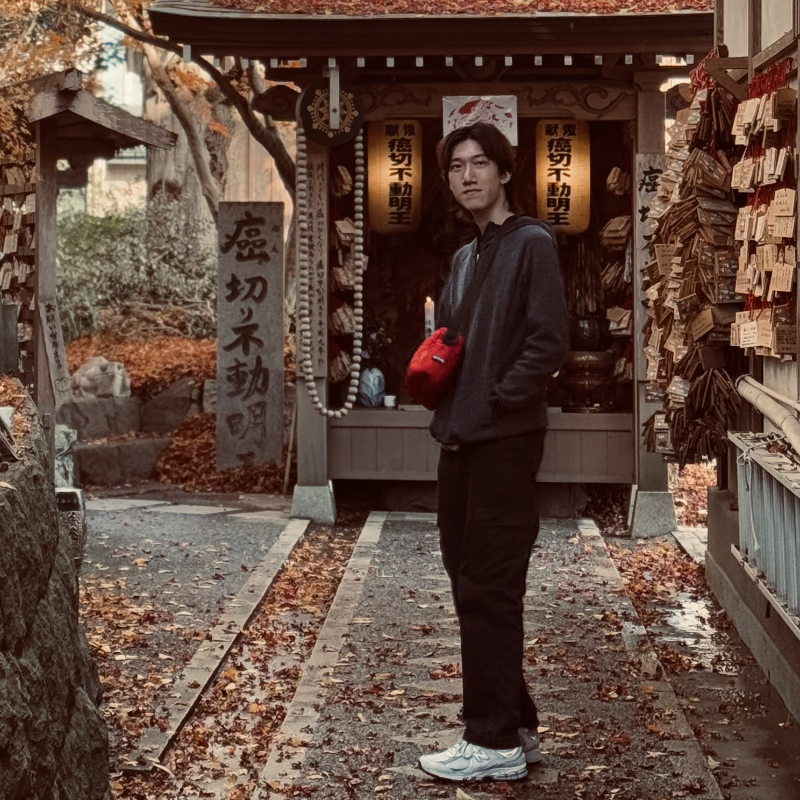
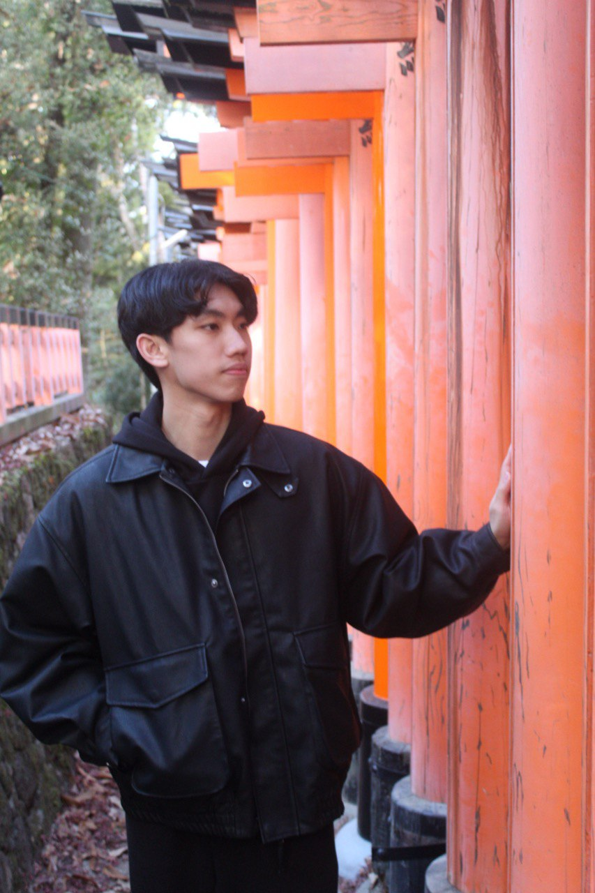

# About Us

We are a team based in the [School of Computing, National University of Singapore](http://www.comp.nus.edu.sg).

You can reach us at the email `seer[at]comp.nus.edu.sg`

## Project team

### Lee Chen Xuan

[[github](https://github.com/CXl0l0)]
[[email](mailto:leechenxuan234@gmail.com)]

- Role: Developer
- Responsibilities: Proof-reading

### Kong Zi Hung

  

Hi I am year 2 Computer Science student in NUS.

[[homepage](https://www.linkedin.com/in/kong-zi-hung-a32ab8288/)]
[[github](https://github.com/zihung20)]
[[email](mailto:zihung20@gmail.com)]

* Role: student
* Responsibilities: technical support, integration, documentation

### Jun Heng

[[github](http://github.com/junixm)]
[[portfolio](https://sites.google.com/view/leejunheng)]

* Role: Developer
* Responsibilities: Deliverables and deadlines.
  Ensure project deliverables are done on time and in the right format.

### Corey Siah

[[github](http://github.com/coreysiah)]
[[email](mailto:e1427143@u.nus.edu)]

* Role: Developer
* Responsibilities: User story and feature list
