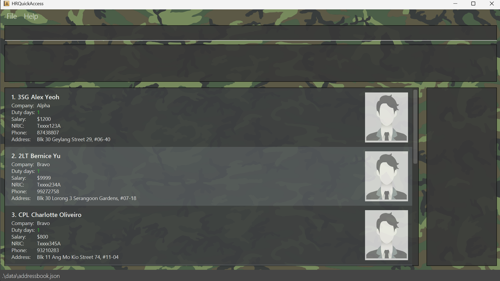

# HRQuickAccess User Guide

## Introducing: **HRQuickAccess**

HRQuickAccess is a **desktop application** designed for **S1 Branch HR staff** to manage trooper information efficiently. It provides **fast, keyboard-focused access** to personnel records, including **contact details and duty dates**, while ensuring **offline functionality** in compliance with **SAF security constraints**. The application is optimized for use via a **Command Line Interface (CLI)** while retaining the benefits of a **Graphical User Interface (GUI)**.

<!-- * Table of Contents -->
- [Quick start](#quick-start)
- [Features](#features)
    - [Notes about Command Format](#notes-about-command-format)
    - [Viewing help: help](#viewing-help-help)
    - [Listing All Personnel: list](#listing-all-personnel-list)
    - [Adding a Personnel Entry: add](#adding-a-personnel-entry-add)
    - [Deleting a Personnel Entry: delete](#deleting-a-personnel-entry-delete)
    - [Editing a Personnel Entry: edit](#editing-a-personnel-entry-edit)
    - [Find a Personnel's Details: find](#finding-a-personnel-find)
    - [Filter personnel entries: filter](#filtering-by-company-filter)
    - [Viewing a Personnel's Duty Date(s): view](#viewing-duty-dates-view)
    - [Assigning Duty: assign](#assigning-duty-assign)
    - [Unassigning Duty: unassign](#unassigning-duty-unassign)
    - [Reassigning Duty: reassign](#reassigning-duty-reassign)
    - [Clearing all entries: clear](#clearing-all-entries-clear)
    - [Exiting the program: exit](#exiting-the-program-exit)
    - [Saving and Editing data](#saving-and-editing-data)
    - [FAQ](#faq)
- [Known issues](#known-issues)
- [Considerations](#considerations)
- [Command summary](#command-summary)


---

## Quick Start

1. Ensure **Java 17 or above** is installed on your computer.<br>
   **Mac users:** Ensure you have the precise JDK version prescribed [here](https://se-education.org/guides/tutorials/javaInstallationMac.html).
2. Download the latest `.jar` file from [Here](https://github.com/AY2425S2-CS2103T-T15-1a/tp/releases/tag/V1.4).
3. Copy the file to the folder you want to use as the **home folder** for HRQuickAccess.
4. Open a **command terminal**, navigate (`cd`) to the folder where you placed the .jar file.
5. Run the application with the command:
   ```bash
   java -jar HRQuickAccess.jar
   ```
5. A GUI similar to the one below should appear in a few seconds, with some **sample data preloaded**.
    - The top bar is the **command box**. Type any command here and press Enter to execute it.
    - The left panel displays a **list of personnel** and their details.
    - The right panel will display the **duty dates** of a selected personnel when using commands like `view`.
   
6. Type a **command** in the command box and press **Enter** to execute it.

### Example Commands
- `help` — Opens the help window.
- `list` — Lists all personnel.
- `add n/Corey p/91234567 a/123 Orchard Road, #03-45 nr/Txxxx123A s/800 c/Alpha r/PTE` — Adds a new personnel entry.
- `delete 2` — Deletes the 2nd personnel in the list.
- `clear` — Clears all personnel entries.
- `exit` — Exits the application.

Refer to the [Features](#features) section below for full command details.

---

## Features

### Notes about Command Format
- Words in `UPPER_CASE` are parameters **you supply**.<br>
  `Example: add n/[NAME] p/[PHONE] a/[ADDRESS] nr/[MASKED NRIC] s/[SALARY] c/[COMPANY] r/[RANK]`
- **Parameters can appear in any order** (unless stated).
- **Optional repeated fields** use `...`, e.g., `[INDEX]...`.
- **Commands with incorrect formats** will return error messages with explanations.

---

### Viewing Help: `help`
Displays information on how to access the help page.

**Format:**
```
help
```

---

### Listing All Personnel: `list`
Shows all personnel in the HR database.

**Format:**
```
list
```

---

### Adding a Personnel Entry: `add`
Adds a trooper to the system.

**Format:**
```
add n/NAME p/PHONE a/ADDRESS nr/MASKED_NRIC s/SALARY c/COMPANY r/RANK
```
**Example:**
```
add n/Corey p/91234567 a/123 Orchard Road nr/Txxxx123A s/800 c/Alpha r/PTE
```

**Validation:**
- **Name:** Name can contain alphabetical characters, spaces, and at most one of each special character (i.e. slashes (/), at symbol (@), hyphens (-)), and must not be blank; leading and trailing spaces are trimmed
- **Phone:** 8-digit, starts with 8 or 9
- **Address:** Alphanumeric characters, spaces, special characters (i.e., comma, period, hashtags, parentheses)
- **Company:** Alphabetical characters
- **Rank:** 2-4 Uppercase alphanumeric characters (e.g., CPL, 2LT)
- **Salary:** 100–9999 SGD
- **NRIC:** `[S/T]xxxx[3-digits][A-Z]` (e.g., Txxxx1234Z)

> **Important:**  
> **Duplicate Entry:** You cannot add a duplicate person. A person is considered a duplicate if the **Name** and **Masked NRIC** are the same as an existing person.

[See considerations for more details](#considerations)

---

### Deleting a Personnel Entry: `delete`
Removes a personnel entry by index.

**Format:**
```
delete INDEX
```
**Example:**
```
delete 2
```
**Validation:** Index must be a valid positive integer.

---

### Editing a Personnel Entry: `edit`
Updates a personnel's info.

**Format:**
```
edit INDEX [n/NAME] [p/PHONE] [a/ADDRESS] [nr/MASKED_NRIC] [s/SALARY] [c/COMPANY] [r/RANK]
```
**Example:**
```
edit 1 n/Jane Doe p/91234567
```

**Validation:** Same rules as `add`. Index must be valid.

---

### Finding a Personnel: `find`
Searches personnel by name.

**Format:**
```
find NAME [NAME]...
```
**Example:**
```
find Corey
```

**Validation:** Alphabets and spaces only. Case-insensitive.

---

### Filtering by Company: `filter`
Filters personnel by company name(s). You can use a substring of a company name.

**Format:**
```
filter c/COMPANY [COMPANY]...
```
**Examples:**
```
filter c/ALPHA
filter c/BRAVO CHARLIE
filter c/BRA
```

**Validation:** Alphabetical characters and spaces only. Case-insensitive. Substrings allowed.

---

### Viewing Duty Dates: `view`
Displays duty dates assigned to a personnel.

**Format:**
```
view INDEX
```
**Example:**
```
view 2
```

**Validation:** Index must be a valid positive integer.

---

### Assigning Duty: `assign`
Assigns a duty date to one or more personnel. Ignores duplicate dates.

**Format:**
```
assign INDEX... d/yyyy-MM-dd
```
**Example:**
```
assign 1 2 3 d/2025-04-15
```

**Validation:**
- INDEX must be valid, the sequence need not be sorted.
- Date must follow ISO format `yyyy-MM-dd`

---

### Unassigning Duty: `unassign`
Removes a duty date from one personnel.

**Format:**
```
unassign [INDEX] d/yyyy-MM-dd
```
**Example:**
```
unassign 1 d/2025-04-15
```

**Validation:** Date must exist and follow ISO format.

---

### Reassigning Duty: `reassign`
Replaces one duty date with another for a specific personnel.

**Format:**
```
reassign INDEX d/OLD_DATE nd/NEW_DATE
```
**Example:**
```
reassign 1 d/2025-04-15 nd/2025-04-25
```

**Validation:** Both dates must be valid ISO-formatted.

---

### Clearing All Entries: `clear`
Removes all personnel entries.

**Format:**
```
clear
```

---

### Exiting the Program: `exit`
Closes the application.

**Format:**
```
exit
```

---

## Saving and Editing Data
- Data is saved automatically after each change.
- Stored locally at: `[JAR folder]/data/addressbook.json`

> ⚠️ **Caution**: Manual edits to the JSON file may corrupt data. Always back up first.

---

## FAQ

**Q:** _How do I transfer my HRQuickAccess data to another computer?_  
**A:** Install the app on the new computer and replace its `addressbook.json` file with your backup.

---

## Known Issues

1. **GUI opens off-screen** after disconnecting a secondary monitor.  
   _Fix_: Delete `preferences.json`.
2. **Help Window doesn't reappear** if previously minimized.  
   _Fix_: Manually restore the minimized window.

---

## Considerations

1. Company and rank allows for alphabetical and alphanumeric characters respectively instead of using enumeration for flexibility, as different services and battalions have different naming styles.
2. Masked NRICs are not unique, so unique personnel are determined by 2 features: Name and Masked NRIC. If they are unique to another personnel, they will be determined as separate entities.
3. Mass assigning duty dates to multiple personnel results in the last index to be highlighted (e.g. if you "assign 3 1 2 d/2025-05-06", the personnel with index 2 is highlighted).
4. To add a personnel profile photo, the photo will have to be renamed as `[NAME]_[NRIC].png/jpeg/jpg` (e.g. Corey Siah_Txxxx123A.png), and placed in `./data/images/`.
5. Do not attempt to manually amend `addressbook.json` as it may result in data corruption.
6. `name` automatically trims leading and trailing spaces.
7. Personnel duty dates reflect the number of duty dates they are assigned in the current month.

---

## Command Summary

| Action             | Format & Example                                                                                       |
|--------------------|--------------------------------------------------------------------------------------------------------|
| **Help**           | `help`                                                                                                 |
| **List**           | `list`                                                                                                 |
| **Add**            | `add n/Corey p/91234567 a/263 River Valley Road #09-11 Aspen Heights nr/Txxxx345H s/800 c/ALPHA r/CPL` |
| **Delete**         | `delete INDEX` <br> e.g., `delete 2`                                                                   |
| **Edit**           | `edit INDEX [fields]` <br> e.g., `edit 1 n/Jane Doe p/91234567`                                        |
| **Find**           | `find NAME [NAME]...` <br> e.g., `find Corey`                                                          |
| **Filter**         | `filter c/COMPANY [COMPANY]...` <br> e.g., `filter c/ALPHA BRAVO`                                      |
| **View**           | `view INDEX` <br> e.g., `view 3`                                                                       |
| **Assign**         | `assign INDEX... d/yyyy-MM-dd` <br> e.g., `assign 1 2 d/2025-04-15`                                    |
| **Unassign**       | `unassign INDEX... d/yyyy-MM-dd` <br> e.g., `unassign 1 d/2025-04-15`                                  |
| **Reassign**       | `reassign INDEX d/OLD nd/NEW` <br> e.g., `reassign 1 d/2025-04-15 nd/2025-04-25`                       |
| **Clear**          | `clear`                                                                                                |
| **Exit**           | `exit`                                                                                                 |

